# MEDICAL API


## 1. Описание проекта
Проект предоставляет методы для формирования базы данных медицинских справочников, для хранения терминологии, 
кодов терминов и контекста. 

API может использоваться в медицинских системах для формирования электронных очередей, электронной документации и т.п.

Система медицинских справочников позволяет работать со следующими объектами.
1. **Справочник**:
  - Идентификатор
  - Код (строка, 100 символов, обязательно для заполнения)
  - Наименование (строка, 300 символов, обязательно для заполнения)
  - Описание (текст произвольной длины)

2. **Версия справочника**:
  - Идентификатор
  - Идентификатор справочника (обязательно для заполнения)
  - Версия (строка, 50 символов, обязательно для заполнения)
  - Дата начала действия версии (дата)

3. **Элемент справочника**:
  - Идентификатор
  - Идентификатор Версии справочника (обязательно для заполнения)
  - Код элемента (строка, 100 символов, обязательно для заполнения)
  - Значение элемента (строка, 300 символов, обязательно для заполнения)


Для доступа к системе и обмена данных реализованы следующие функциональные API:
1. Получение списка справочников [опционно, актуальных на указанную дату]

http://127.0.0.1:8000/refbooks/[?date=<date>]

2. Получение элементов справочника [опционно, для конкретной версии справочника]

http://127.0.0.1:8000/refbooks/<id>/elements/[?version=<version>]

3. Проверка существования элемента с заданными кодом и значением в конкретной версии 
справочника [опционно, для конкретной версии справочника] 

http://127.0.0.1:8000/refbooks/<id>/check_element?code=<code>&value=<value>[&version=<version>]

Документация API доступна http://127.0.0.1:8000/api/schema/swagger/

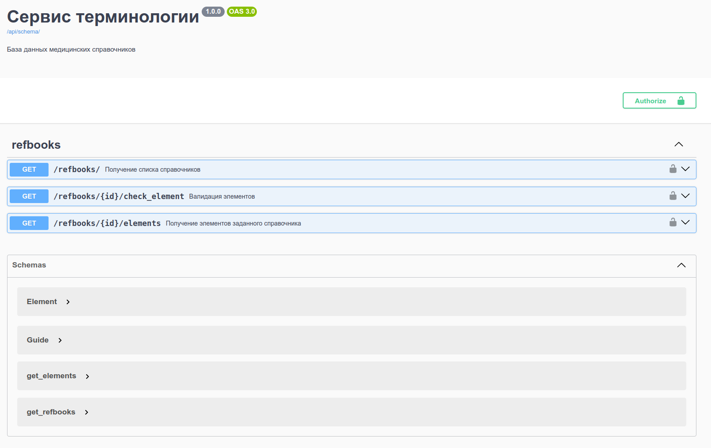

Документация


Заполнение системы медицинских справочников осуществляется через панель администрирования. Интерфейс 
административной панели реализован на русском языке.

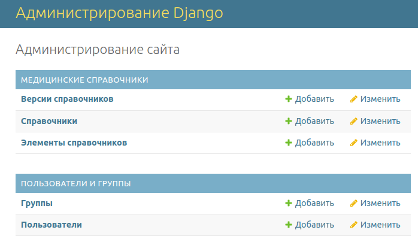

Административная панель


Административная панель имеет следующие возможности:

1. Добавление, изменение, удаление справочника. 

    При редактировании справочника должны заполняются поля: 
    - Код (строка, обязательно для заполнения)
    - Наименование (строка, обязательно для заполнения)
    - Описание (текст произвольной длинны). 
   
   При редактировании справочника на этой же странице отображается список имеющихся версий данного справочника 
с возможностью редактирования. 

    В списке справочников отображаются поля *Идентификатор*, *Код*, *Наименование*, 
*Текущая версия* и *Дата начала действия версии*.

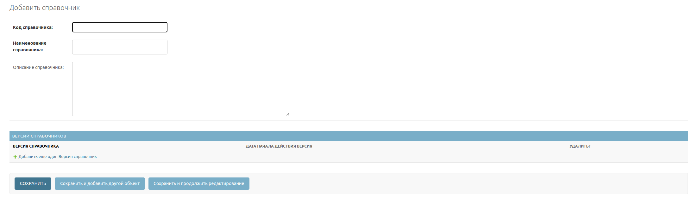

Добавление справочника

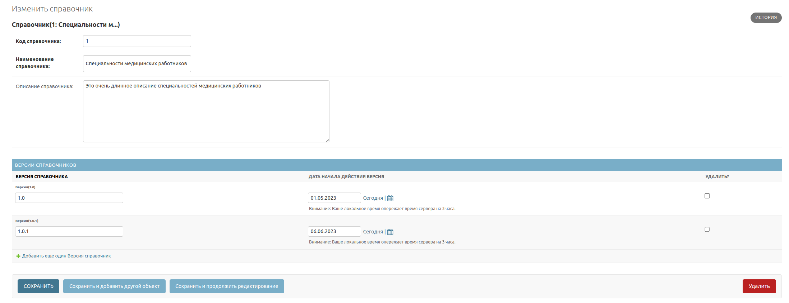

Редактирование справочника

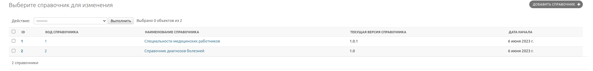

Список справочников


2. Добавление, изменение, удалении версии справочника. 

    При редактировании версии справочника заполняются поля: 
   - Справочник (выбор из списка)
   - Версия (строка)
   - Дата начала действия (выбор из календаря). 
   
   При редактировании версии на этой же странице реализована возможность заполнить элементы справочника в этой версии.
   
   В списке версий справочника отображаются поля: *Код справочника*, *Наименование справочника*, 
*Версия*, *Дата начала версии*.

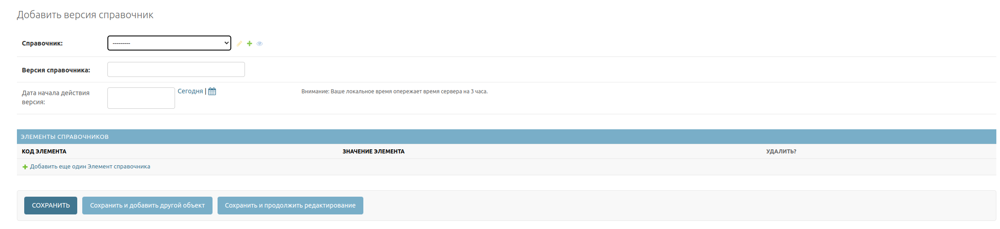

Добавление версии справочника

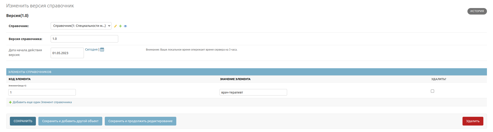

Редактирование версии справочника

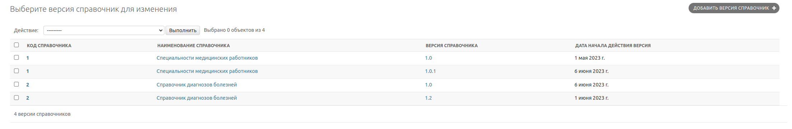

Список версий справочников

3. Добавление, изменение, удаление элементов в версии справочника. 

    При редактировании элементов заполняются поля: 
   - Версия (выбор из списка "справочник-версия")
   - Код элемента (строка)
   - Значение элемента (строка).

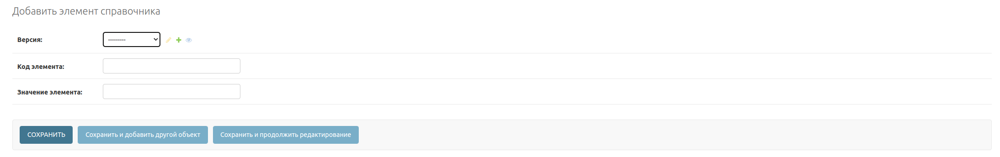

Добавление элемента справочника

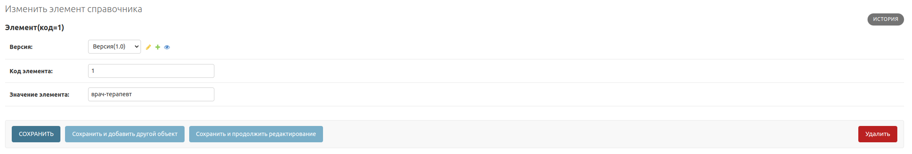

Редактирование элемента справочника

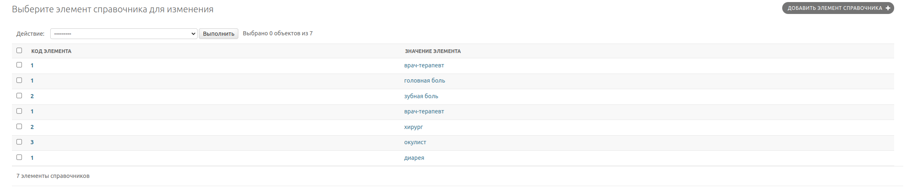

Список элементов справочников


## 2. Требования к окружению
  * Версия Python >= 3.10


## 3. Разворачивание приложения

* Клонирование репозитория
 ```commandline
   git clone https://github.com/Sergei-V-Fedorov/MedicalAPI.git
 ```

* Создание виртуального окружения 
 ```commandline
  cd MedicalAPI && python3 -m venv venv && source venv/bin/activate
 ```

* Установка зависимостей:
```commandline
pip install -r requirements.txt
```

### Первичная настройка проекта
* Создание учетной записи администратора
```commandline
python manage.py migrate
```
```commandline
python manage.py createsuperuser
```
 - Login: admin
 - password: admin
 - email: -

* Применение миграций и создание базы данных
```commandline
python manage.py makemigrations
```
```commandline
python manage.py migrate
```

* Инициализация базы данных (загрузка фикстур)
```commandline
python manage.py loaddata guides/fixtures/guides.json
```


## 4. Запуск приложения
```commandline
python manage.py runserver
```


## 5. Вход в административную панель:
 - http://127.0.0.1:8000/admin
 - Login: admin
 - password: admin


## 6. Примеры обращения к API
* Список всех доступных справочников 
    
   http://127.0.0.1:8000/refbooks/


 * Список справочников отфильтрованных по дате 

   http://127.0.0.1:8000/refbooks/?date=2023-06-01


 * Получение элементов справочника 1

   http://127.0.0.1:8000/refbooks/1/elements/ 


 * Получение элементов справочника 1 версии 1.0

   http://127.0.0.1:8000/refbooks/1/elements/?version=1.0


 * проверка существования элемента с кодом и значением в конкретной версии справочника. 
   http://127.0.0.1:8000/refbooks/1/check_element/?code=2&value=хирург

   http://127.0.0.1:8000/refbooks/1/check_element/?code=4&value=офтальмолог

   http://127.0.0.1:8000/refbooks/1/check_element/?code=1&value=врач-терапевт&version=1.0


 * Документация к API

   http://127.0.0.1:8000/api/schema/swagger/
